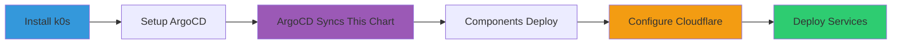

# Deployment Guide for cluster-serverless

Complete deployment guide for benedict-aryo.com serverless platform.

## 🎯 Deployment Flow



## 📋 Prerequisites Checklist

- [ ] k0s cluster running (via k0s-cluster-bootstrap)
- [ ] ArgoCD installed and accessible
- [ ] Sealed Secrets controller running
- [ ] Domain benedict-aryo.com in Cloudflare
- [ ] kubectl configured with cluster access

## 🚀 Step-by-Step Deployment

### Phase 1: Cluster Bootstrap (5-10 minutes)

Already completed if you used [k0s-cluster-bootstrap](https://github.com/BenedictusAryo/k0s-cluster-bootstrap):

```bash
# Controller node
./scripts/install-k0s-controller.sh
./scripts/setup-argocd.sh

# Worker nodes (optional)
./scripts/install-k0s-worker.sh
```

### Phase 2: Verify ArgoCD Application (2-3 minutes)

```bash
# Check if cluster-serverless app is registered
kubectl get application cluster-serverless -n argocd

# View sync status
kubectl describe application cluster-serverless -n argocd

# Watch ArgoCD sync the components
kubectl get pods -A -w
```

Expected components being deployed:
- Cilium (CNI networking)
- Knative Serving + Eventing
- Kourier (ingress)
- OpenTelemetry Collector
- Jaeger

### Phase 3: Configure Cloudflare Tunnel (10-15 minutes)

#### Option A: Via Cloudflare Dashboard (Recommended)

1. **Create Tunnel**:
   - Go to https://one.dash.cloudflare.com/
   - Navigate to **Access** → **Tunnels**
   - Click **Create a tunnel**
   - Name: `k0s-homelab-tunnel`
   - Choose **Cloudflared** connector
   - **Save the tunnel token!**

2. **Configure Public Hostnames**:
   
   Add these routes:
   
   | Public Hostname | Service | Type |
   |----------------|---------|------|
   | `*.benedict-aryo.com` | `kourier-gateway.kourier-system.svc.cluster.local:80` | HTTP |
   | `argocd.benedict-aryo.com` | `argocd-server.argocd.svc.cluster.local:443` | HTTPS |
   | `jaeger.benedict-aryo.com` | `jaeger-query.observability.svc.cluster.local:16686` | HTTP |

3. **Generate Sealed Secret**:

   ```bash
   cd cluster-serverless/scripts
   chmod +x generate-sealed-secret.sh
   ./generate-sealed-secret.sh
   # Enter tunnel token when prompted
   ```

4. **Apply Sealed Secret**:

   ```bash
   # Commit to Git for GitOps
   git add cloudflare-tunnel-sealed-secret.yaml
   git commit -m "Add Cloudflare Tunnel credentials"
   git push
   
   # Or apply directly
   kubectl apply -f cloudflare-tunnel-sealed-secret.yaml
   ```

5. **Enable in values.yaml**:

   ```yaml
   cloudflareTunnel:
     enabled: true  # Change from false to true
   ```

   Commit and push, ArgoCD will sync automatically.

#### Option B: Via CLI (Advanced)

```bash
# Install cloudflared
wget https://github.com/cloudflare/cloudflared/releases/latest/download/cloudflared-linux-amd64.deb
sudo dpkg -i cloudflared-linux-amd64.deb

# Login and create tunnel
cloudflared tunnel login
cloudflared tunnel create k0s-homelab-tunnel

# Configure DNS
cloudflared tunnel route dns k0s-homelab-tunnel "*.benedict-aryo.com"
cloudflared tunnel route dns k0s-homelab-tunnel argocd.benedict-aryo.com
cloudflared tunnel route dns k0s-homelab-tunnel jaeger.benedict-aryo.com

# Get credentials and create sealed secret
# Use the generate-sealed-secret.sh script
```

### Phase 4: Verify Deployment (5 minutes)

```bash
# Check all pods are running
kubectl get pods -A

# Verify Knative is ready
kubectl get pods -n knative-serving
kubectl get pods -n knative-eventing

# Check Kourier gateway
kubectl get svc -n kourier-system

# Verify Cloudflare Tunnel (if enabled)
kubectl get pods -n cloudflare-tunnel
kubectl logs -n cloudflare-tunnel deployment/cloudflared

# Check OpenTelemetry and Jaeger
kubectl get pods -n observability
```

### Phase 5: Deploy Test Service (5 minutes)

Create your first Knative service:

```bash
cat <<EOF | kubectl apply -f -
apiVersion: serving.knative.dev/v1
kind: Service
metadata:
  name: hello-world
  namespace: default
spec:
  template:
    spec:
      containers:
      - image: gcr.io/knative-samples/helloworld-go
        env:
        - name: TARGET
          value: "Benedict Aryo's Serverless Platform"
        ports:
        - containerPort: 8080
EOF
```

**Verify**:

```bash
# Check service status
kubectl get ksvc hello-world

# Get URL
kubectl get ksvc hello-world -o jsonpath='{.status.url}'

# Test (after Cloudflare Tunnel is configured)
curl https://hello-world.default.benedict-aryo.com
```

Expected response:
```
Hello Benedict Aryo's Serverless Platform!
```

## 🔍 Verification Checklist

- [ ] All ArgoCD applications are "Synced" and "Healthy"
- [ ] Cilium pods running (check with `cilium status`)
- [ ] Knative Serving + Eventing controllers ready
- [ ] Kourier gateway service exists
- [ ] Cloudflare Tunnel connected (check dashboard)
- [ ] Test service accessible via benedict-aryo.com
- [ ] ArgoCD UI accessible at argocd.benedict-aryo.com
- [ ] Jaeger UI accessible at jaeger.benedict-aryo.com

## 🎨 Access Points

After successful deployment:

| Service | URL | Credentials |
|---------|-----|-------------|
| **Knative Services** | `https://*.benedict-aryo.com` | N/A |
| **ArgoCD UI** | `https://argocd.benedict-aryo.com` | admin / (from kubectl) |
| **Jaeger Tracing** | `https://jaeger.benedict-aryo.com` | N/A |

Get ArgoCD password:
```bash
kubectl -n argocd get secret argocd-initial-admin-secret \
  -o jsonpath="{.data.password}" | base64 -d
```

## 🐛 Troubleshooting

### ArgoCD Not Syncing

```bash
# Check application status
kubectl describe application cluster-serverless -n argocd

# Force sync
kubectl patch application cluster-serverless -n argocd \
  --type merge -p '{"operation":{"sync":{}}}'

# Check ArgoCD logs
kubectl logs -n argocd deployment/argocd-application-controller
```

### Cloudflare Tunnel Not Connecting

```bash
# Check tunnel pods
kubectl get pods -n cloudflare-tunnel

# View logs
kubectl logs -n cloudflare-tunnel deployment/cloudflared -f

# Verify secret exists
kubectl get secret cloudflare-tunnel-secret -n cloudflare-tunnel

# Test connectivity
kubectl exec -it -n cloudflare-tunnel deployment/cloudflared -- \
  cloudflared tunnel info
```

### Knative Service Not Accessible

```bash
# Check service status
kubectl get ksvc -A

# Describe the service
kubectl describe ksvc hello-world -n default

# Check Kourier gateway
kubectl get svc -n kourier-system
kubectl logs -n kourier-system deployment/3scale-kourier-gateway

# Test internal connectivity
kubectl run test --rm -it --image=curlimages/curl -- \
  curl -H "Host: hello-world.default.benedict-aryo.com" \
  http://kourier-gateway.kourier-system.svc.cluster.local
```

## 📊 Monitoring

### View Distributed Traces

1. Open Jaeger UI: https://jaeger.benedict-aryo.com
2. Select service from dropdown
3. View request traces and latency

### Check Resource Usage

```bash
# Node resources
kubectl top nodes

# Pod resources
kubectl top pods -A

# Specific namespace
kubectl top pods -n knative-serving
```

## 🔄 Updates and Maintenance

### Update Component Versions

Edit `values.yaml`:

```yaml
knativeServing:
  version: "1.21.0"  # Update version

cilium:
  version: "1.17.0"  # Update version
```

Commit and push - ArgoCD will automatically sync.

### Scale Replicas

```yaml
kourier:
  gateway:
    replicas: 3  # Increase for HA

cloudflareTunnel:
  replicas: 3  # Increase tunnel replicas
```

## 🎓 Next Steps

1. **Deploy More Services**: Create Knative services for your applications
2. **Set up CI/CD**: Integrate with GitHub Actions
3. **Configure Monitoring**: Set up Prometheus + Grafana
4. **Enable Autoscaling**: Fine-tune Knative autoscaling parameters
5. **Add Event Sources**: Deploy Knative Eventing sources

## 📚 Resources

- [Knative Documentation](https://knative.dev/docs/)
- [Cilium Documentation](https://docs.cilium.io/)
- [ArgoCD Documentation](https://argo-cd.readthedocs.io/)
- [Cloudflare Tunnel Docs](https://developers.cloudflare.com/cloudflare-one/connections/connect-networks/)
- [TSD Document](../TSD.md) - Technical Specification
- [FSD Document](../FSD.md) - Functional Specification
