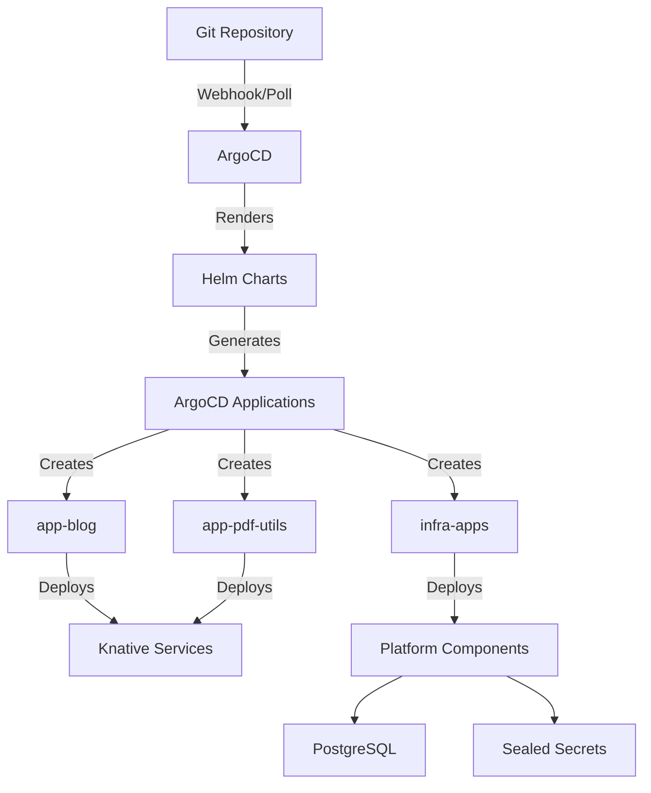
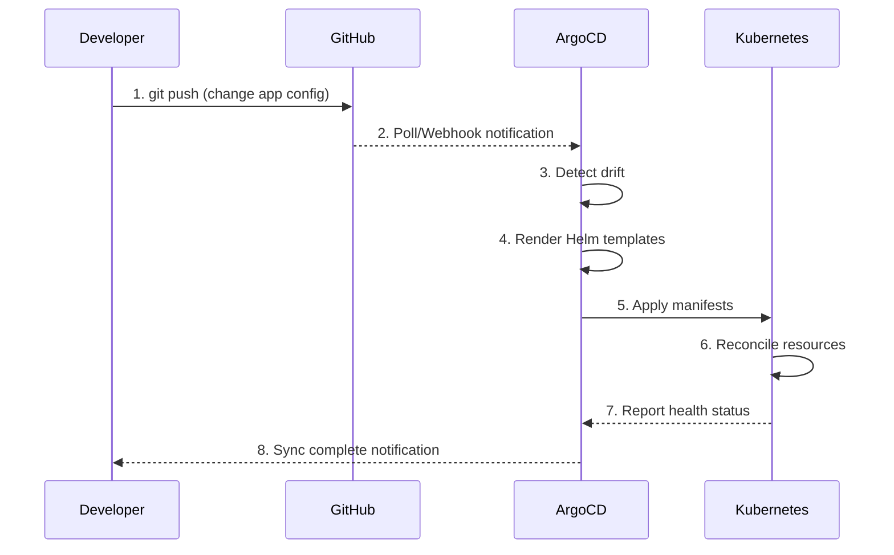

# 🚀 Production-Grade Knative Platform on Kubernetes

<div align="center">

**A GitOps-driven, serverless-first Kubernetes platform showcasing modern cloud-native architecture and platform engineering practices**

[](https://k0sproject.io/)
[](https://argoproj.github.io/cd/)
[](https://knative.dev/)
[](https://helm.sh/)
[](https://traefik.io/)

[Live Demo](https://benedict-aryo.com) • [Architecture](#-architecture) • [Features](#-key-features) • [Getting Started](#-getting-started)

</div>

---

## 📋 Table of Contents

- [Overview](#-overview)
- [Key Features](#-key-features)
- [Architecture](#-architecture)
- [Technology Stack](#-technology-stack)
- [Repository Structure](#-repository-structure)
- [Getting Started](#-getting-started)
- [GitOps Workflow](#-gitops-workflow)
- [Platform Engineering Highlights](#-platform-engineering-highlights)

---

## 🎯 Overview

This repository demonstrates **production-grade platform engineering** by implementing a fully automated, GitOps-driven Kubernetes platform for serverless application deployment. Built for a single-node VPS, it showcases how to design, deploy, and operate cloud-native infrastructure using industry best practices.

### What Makes This Special?

- **100% GitOps**: Everything is declarative and version-controlled—infrastructure, applications, and configurations
- **Serverless-First**: Applications automatically scale to zero when idle, optimizing resource utilization
- **Zero-Touch Operations**: After initial bootstrap, all changes flow through Git commits (no manual kubectl commands)
- **Production-Ready Security**: TLS everywhere, encrypted secrets, principle of least privilege
- **App-of-Apps Pattern**: Hierarchical ArgoCD applications for scalable multi-tenant management

### Real-World Applications

- 🌐 **[Personal Blog](https://benedict-aryo.com)** - Django application with PostgreSQL backend
- 📄 **[PDF Utilities](https://pdf.benedict-aryo.com)** - Document processing service
- ⚙️ **Platform Services** - ArgoCD, PostgreSQL, monitoring stack

---

## ✨ Key Features

### Platform Engineering

| Feature | Implementation | Benefit |
|---------|---------------|---------|
| **GitOps Automation** | ArgoCD with App-of-Apps pattern | Single source of truth, audit trail, easy rollbacks |
| **Serverless Runtime** | Knative Serving | Scale-to-zero, automatic scaling, cost optimization |
| **Infrastructure as Code** | Helm charts + Kubernetes manifests | Reproducible deployments, version control |
| **Secrets Management** | Sealed Secrets | Encrypted secrets safely stored in Git |
| **Per-App Isolation** | Individual ArgoCD Applications | Independent sync, granular RBAC, isolated deployments |

### Developer Experience

- **Self-Service App Deployment**: Add new apps by creating a directory and updating values.yaml
- **Automatic TLS**: Let's Encrypt certificates provisioned automatically
- **Database Provisioning**: PostgreSQL databases created per-app with sealed credentials
- **Traffic Routing**: Custom domain mapping with Knative DomainMapping CRDs

### Operational Excellence

- **Bootstrap Once, GitOps Forever**: Initial cluster setup, then pure Git-driven operations
- **Separation of Concerns**: Clear boundaries between apps, infrastructure, and platform config
- **Pull-Based Reconciliation**: ArgoCD continuously ensures desired state
- **Health Monitoring**: Custom health checks for single-node VPS architecture

---

## 🏗️ Architecture

### Request Flow

```
┌─────────────┐
│   Internet  │
└──────┬──────┘
       │ HTTPS (TLS via Let's Encrypt)
       ▼
┌─────────────────────────┐
│  Traefik (Edge Ingress) │ ← TLS Termination, L7 Routing
└──────┬──────────────────┘
       │
       ├──→ argocd.* ──→ [ArgoCD Dashboard]
       │
       └──→ *.benedict-aryo.com
                  │
                  ▼
       ┌──────────────────────┐
       │ Kourier (Knative L7) │
       └──────┬───────────────┘
              │
    ┌─────────┴─────────┐
    ▼                   ▼
[Blog Service]    [PDF Service]
 (Scale-to-0)      (Scale-to-0)
```

### GitOps Control Flow



### App-of-Apps Hierarchy

```
cluster-serverless-root (Helm)
├── app-blog
│   ├── Knative Service
│   ├── DomainMapping
│   ├── SealedSecrets
│   └── PostgreSQL Config Job
├── app-pdf-utils
│   ├── Knative Service
│   ├── DomainMapping
│   └── Persistent Volume
└── infra-apps
    ├── ArgoCD Config
    ├── PostgreSQL Cluster
    ├── Traefik-Kourier Routes
    └── Sealed Secrets Controller
```

---

## 🛠️ Technology Stack

<table>
<tr>
<td valign="top" width="50%">

### Platform Layer
- **Kubernetes Distribution**: [k0s](https://k0sproject.io/) (lightweight, single-binary)
- **Container Runtime**: containerd
- **Package Manager**: Helm 3
- **GitOps Engine**: ArgoCD
- **VCS**: GitHub

### Networking
- **Edge Ingress**: Traefik 2.x
- **Service Mesh**: Kourier (Knative networking)
- **TLS/Certificates**: Let's Encrypt (ACME)
- **DNS**: Cloudflare

</td>
<td valign="top" width="50%">

### Application Layer
- **Serverless Framework**: Knative Serving
- **Database**: PostgreSQL 17 (Bitnami Helm chart)
- **Secret Encryption**: Sealed Secrets
- **Image Registry**: GitHub Container Registry (GHCR)

### Observability (Planned)
- **Metrics**: Prometheus
- **Visualization**: Grafana
- **Logging**: Loki (future)

</td>
</tr>
</table>

---

## 📁 Repository Structure

```
.
├── apps/                              # User-facing applications
│   ├── blog/
│   │   ├── values.yaml                # Knative Service definition
│   │   ├── domainmapping.yaml         # Custom domain mapping
│   │   ├── secret.yaml                # Sealed secrets
│   │   ├── postgres-values.yaml       # Database provisioning
│   │   └── ghcr-login-sealed.yaml     # Registry authentication
│   └── pdf-utils/
│       ├── values.yaml
│       ├── domainmapping.yaml
│       ├── secret.yaml
│       └── persistence.yaml           # PVC for file storage
│
├── charts/
│   └── primary-chart/                 # Root Helm chart (App-of-Apps)
│       ├── Chart.yaml
│       ├── values.yaml                # Application registry
│       └── templates/
│           ├── argocd-apps.yaml       # Generates child Applications
│           └── namespaces.yaml        # Namespace creation
│
├── infra-apps/                        # Platform infrastructure
│   ├── argocd-config.yaml             # ArgoCD ConfigMap + RBAC
│   ├── argocd-ingress.yaml            # ArgoCD dashboard routing
│   ├── postgres.yaml                  # PostgreSQL Helm release
│   ├── kourier-bootstrap.yaml         # Knative networking setup
│   └── traefik-kourier-route.yaml     # Traefik → Kourier integration
│
├── cluster-init/                      # Bootstrap scripts (one-time use)
│   ├── bootstrap.sh                   # Master bootstrap script
│   ├── install-k0s-single-node.sh     # k0s installation
│   ├── install-argocd.sh              # ArgoCD installation
│   └── root-application.yaml          # ArgoCD root app
│
├── config/
│   ├── k0s.yaml                       # k0s cluster configuration
│   └── k0s.yaml.default               # Default k0s config template
│
└── README.md                          # This file
```

---

## 🚀 Getting Started

### Prerequisites

- A VPS with:
  - Ubuntu 22.04 LTS (recommended)
  - 4GB RAM minimum (8GB recommended)
  - 20GB+ storage
  - Public IPv4 address
- Domain name with DNS access
- SSH access to the VPS

### Installation

#### 1. Clone the Repository

```bash
git clone https://github.com/BenedictusAryo/cluster-serverless.git
cd cluster-serverless
```

#### 2. Configure DNS

Point your domain to your VPS IP:
```
benedict-aryo.com         A  <VPS_IP>
*.benedict-aryo.com       A  <VPS_IP>
argocd.benedict-aryo.com  A  <VPS_IP>
```

#### 3. Bootstrap the Cluster

```bash
cd cluster-init
./bootstrap.sh
```

This script will:
1. ✅ Install k0s Kubernetes distribution
2. ✅ Configure kubectl access
3. ✅ Install ArgoCD
4. ✅ Deploy the root ArgoCD Application
5. ✅ Wait for all applications to sync

#### 4. Access ArgoCD

```bash
# Get admin password
kubectl -n argocd get secret argocd-initial-admin-secret \
  -o jsonpath="{.data.password}" | base64 -d

# Access dashboard
open https://argocd.benedict-aryo.com
```

#### 5. Deploy Applications

All applications are now managed via Git! Make changes, commit, and push:

```bash
# Example: Update blog image version
vim apps/blog/values.yaml
git add apps/blog/values.yaml
git commit -m "feat(blog): update to v2.0.0"
git push

# ArgoCD automatically detects and deploys the change
```

---

## 🔄 GitOps Workflow

### Day-to-Day Operations



### Adding a New Application

1. **Create app directory**:
   ```bash
   mkdir -p apps/my-app
   ```

2. **Define Knative Service** (`apps/my-app/values.yaml`):
   ```yaml
   apiVersion: serving.knative.dev/v1
   kind: Service
   metadata:
     name: my-app
     namespace: apps
   spec:
     template:
       spec:
         containers:
           - image: ghcr.io/myuser/my-app:latest
             ports:
               - containerPort: 8080
   ```

3. **Configure domain mapping** (`apps/my-app/domainmapping.yaml`):
   ```yaml
   apiVersion: serving.knative.dev/v1beta1
   kind: DomainMapping
   metadata:
     name: myapp.benedict-aryo.com
     namespace: apps
   spec:
     ref:
       name: my-app
       kind: Service
       apiVersion: serving.knative.dev/v1
   ```

4. **Register in ArgoCD** (`charts/primary-chart/values.yaml`):
   ```yaml
   appsList:
     - name: my-app
       path: apps/my-app
       namespace: apps
       project: default
   ```

5. **Commit and push**:
   ```bash
   git add apps/my-app charts/primary-chart/values.yaml
   git commit -m "feat: add my-app application"
   git push
   ```

ArgoCD will automatically:
- Create a new Application `app-my-app`
- Deploy the Knative Service
- Configure domain routing
- Provision TLS certificate

---

## 🎓 Platform Engineering Highlights

### 1. **Independent Application Lifecycle**

Each application has its own ArgoCD Application, enabling:
- **Isolated deployments**: Changes to one app don't affect others
- **Per-app RBAC**: Different teams can manage different apps (ready for multi-tenancy)
- **Independent rollback**: Roll back individual apps without touching others
- **Granular sync policies**: Some apps can auto-sync, others require manual approval

### 2. **Secrets Management Best Practices**

```yaml
# Secrets are encrypted with Sealed Secrets before committing
apiVersion: bitnami.com/v1alpha1
kind: SealedSecret
metadata:
  name: blog-secrets
  namespace: apps
spec:
  encryptedData:
    DATABASE_URL: AgBq8F3... # Encrypted, safe to commit
```

Benefits:
- ✅ Secrets stored in Git (encrypted)
- ✅ Full audit trail of secret changes
- ✅ Cluster-specific encryption keys
- ✅ GitOps-friendly secret rotation

### 3. **Database-per-Service Pattern**

Each application can provision its own PostgreSQL database:

```yaml
# apps/blog/postgres-values.yaml
apiVersion: batch/v1
kind: Job
metadata:
  name: postgres-init-blog
spec:
  template:
    spec:
      containers:
        - name: create-db
          image: postgres:17
          command:
            - sh
            - -c
            - |
              psql -c "CREATE DATABASE blog_db;"
              psql -c "CREATE USER blog_user WITH PASSWORD '***';"
```

This ensures:
- **Isolation**: No cross-app database access
- **Clean separation**: Each app owns its data
- **Easy cleanup**: Delete app = delete database

### 4. **Traffic Management**

Two-tier routing architecture:

```
Traefik (L7 Router)
  ├── Traditional Ingress → Platform services (ArgoCD)
  └── DomainMapping → Knative services (Apps)
          ↓
       Kourier (Knative router)
          ↓
       Knative Services (with auto-scaling)
```

**Why this matters:**
- Traefik handles TLS termination and edge routing
- Kourier provides Knative-specific features (traffic splitting, gradual rollouts)
- Clean separation between platform and application traffic

### 5. **Single-Node VPS Optimization**

Adapted cloud-native patterns for resource-constrained environments:

| Challenge | Solution |
|-----------|----------|
| No LoadBalancer | ClusterIP + host port binding |
| Ingress health checks fail | Custom ArgoCD health checks |
| Resource constraints | Knative scale-to-zero |
| Certificate management | Automated Let's Encrypt via Traefik |

---

## 🔐 Security Considerations

- ✅ **TLS Everywhere**: All traffic encrypted with Let's Encrypt certificates
- ✅ **Secrets Encryption**: Sealed Secrets controller encrypts secrets at rest in Git
- ✅ **Network Policies**: Only Traefik exposed on ports 80/443
- ✅ **Image Scanning**: GHCR integration with vulnerability scanning (recommended)
- ✅ **Least Privilege**: Applications run as non-root with minimal permissions
- ✅ **Git as Audit Log**: All changes tracked with commit history

---

## 📊 Monitoring & Observability (Roadmap)

Future enhancements planned:

- **Metrics**: Prometheus + Grafana dashboards
- **Logging**: Loki for centralized log aggregation
- **Tracing**: Jaeger for distributed tracing
- **Alerting**: AlertManager for proactive notifications
- **Cost Tracking**: Kubecost for resource attribution

---

## 🚧 Future Improvements

- [ ] Migrate to Kubernetes Gateway API
- [ ] Implement External Secrets Operator (ESO)
- [ ] Add OIDC authentication for ArgoCD
- [ ] Multi-cluster support with cluster-gen
- [ ] Progressive delivery (Flagger integration)
- [ ] Automated backup/restore workflows
- [ ] CI/CD integration (GitHub Actions)

---

## 👤 About

This project serves as a portfolio demonstration of:
- **Platform Engineering**: Design and operation of Kubernetes platforms
- **GitOps Practices**: Declarative infrastructure and application delivery
- **Cloud-Native Architecture**: Microservices, serverless, and container orchestration
- **DevOps Automation**: Zero-touch deployments, self-service platforms
- **AIOps Readiness**: Observable, automated, and intelligent operations

Built and maintained by **Benedict Aryo Arrisantoso** | [LinkedIn](https://www.linkedin.com/in/benedict-aryo/) | [GitHub](https://github.com/BenedictusAryo)

---

## 📄 License

MIT License - feel free to use this as a reference for your own projects!

---

<div align="center">

**⭐ If you find this project helpful, please consider starring it! ⭐**

Made with ❤️ using Kubernetes, Knative, and ArgoCD

</div>
